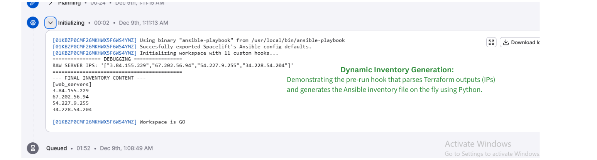

# Automated Infrastructure Orchestration (Terraform + Ansible + Spacelift)


A fully automated, **Zero-Touch CI/CD Pipeline** that provisions immutable infrastructure on AWS using **Terraform** and automatically configures web servers using **Ansible**, orchestrated via **Spacelift**.

---
## 📋 Project Overview

In a typical DevOps workflow, passing data between infrastructure provisioning (Terraform) and configuration management (Ansible) often requires manual intervention (copying IPs, managing SSH keys locally).

**This project solves that problem.**

I have built an event-driven pipeline where a single `git push` triggers a chain reaction:
1.  **Provisioning:** Terraform creates EC2 instances, Security Groups, and Keys on AWS.
2.  **Orchestration:** Spacelift captures the Output IPs from Terraform.
3.  **Configuration:** Spacelift automatically triggers the Ansible stack, injects the IPs into a **Dynamic Inventory**, and configures Nginx.

### 🏗 Architecture Flow

```mermaid
graph LR
    A[Developer] -- Git Push --> B[GitHub]
    B -- Webhook --> C[Spacelift]
    C -- Trigger --> D[Terraform Stack]
    D -- Provision --> E[AWS Cloud]
    D -- Output IPs --> F[Spacelift Context]
    F -- Input Vars --> G[Ansible Stack]
    G -- Configure --> E

Tech Stack & Tools used
Spacelift: For managing Stacks, State files, and Orchestration dependencies.
Terraform (OpenTofu): Infrastructure as Code (IaC) to provision AWS EC2 instances.
Ansible: To configure the servers (Install Nginx, Htop).
Amazon Web Services (AWS): Cloud provider (IAM, EC2, VPC).
GitHub: Version Control and Webhook triggers.
✨ Key Features implemented
1. 🔗 Stack Dependencies & Data Passing
Instead of hardcoding IP addresses, I utilized Spacelift's Stack Dependencies.
Terraform Output: ec2_ips
Ansible Input: SERVER_IPS (Environment Variable)
Result: Ansible always runs on the exact servers created by Terraform.
2. 🛡️ Secure Key Management (The "Copy Strategy")
Handling private keys in a CI/CD runner is tricky due to permission errors (0777 vs 0600).
Problem: Mounted files in Spacelift are read-only or have open permissions, causing SSH to fail.
Solution: Implemented a Pre-Run Hook to copy the key from the mounted volume to a secure source directory and applied chmod 600 programmatically before Ansible execution.
3. 📜 Dynamic Inventory Generation
Since IPs change on every deployment, a static inventory.ini doesn't work.
I wrote a Python One-Liner Hook that parses the JSON list of IPs from Terraform and generates a valid Ansible inventory file on the fly during the initialization phase.

Proof of Work
Here is the visual evidence of the pipeline in action:
1. Stack Dependency Visualization
Visual representation of the orchestration flow within Spacelift, establishing terraform-infra as the upstream dependency passing state data to ansible-stack.

2. Automated Event-Driven Trigger
Zero-Touch Automation: The run history confirms that the Ansible stack was automatically triggered via "Stack Dependency" immediately after Terraform finished applying.

3. Dynamic Inventory Logic via Hooks
The Logic: Logs showing the custom Hook executing the Python script to parse RAW SERVER_IPS and generating the inventory.ini file securely.

4. End-to-End Verification
Final Result: Validation of the Nginx web server configuration on the provisioned EC2 instance IP.

5. Architecture Diagram


How to Replicate
Step 1: Clone the Repository
git clone https://github.com/tayyab-cloud/spacelift-terraform-ansible-practice.git
Step 2: Configure Spacelift Stacks
Create a Terraform Stack pointing to the terraform/ directory.
Create an Ansible Stack pointing to the ansible/ directory.
Add AWS_ACCESS_KEY or configure AWS IAM Role Integration.
Step 3: Add the Magic Hook
In the Ansible Stack -> Settings -> Behavior -> Initialization Hook, add:
# Fix Permissions
chmod -R 755 /mnt/workspace/source

# Secure Copy Private Key
cp /mnt/workspace/ansible_key /mnt/workspace/source/ansible_key_secure
chmod 600 /mnt/workspace/source/ansible_key_secure

# Generate Inventory
echo "[web_servers]" > inventory.ini
python3 -c "import os, json; print('\n'.join(json.loads(os.environ['SERVER_IPS'])))" >> inventory.ini
Step 4: Deploy
Push a change to the main branch and watch the pipeline run automatically!

---

## Author

- **Name:** Tayyab Cloud
- **LinkedIn:** www.linkedin.com/in/tayyab-cloud-automation
- **GitHub:** https://github.com/tayyab-cloud

